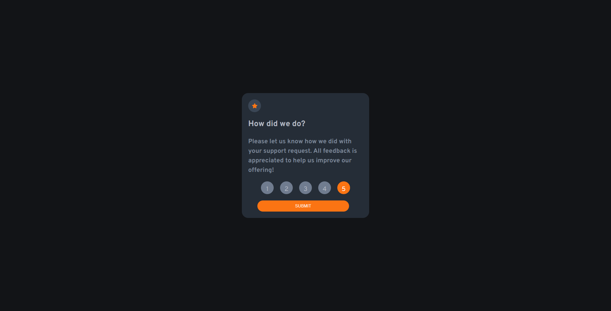
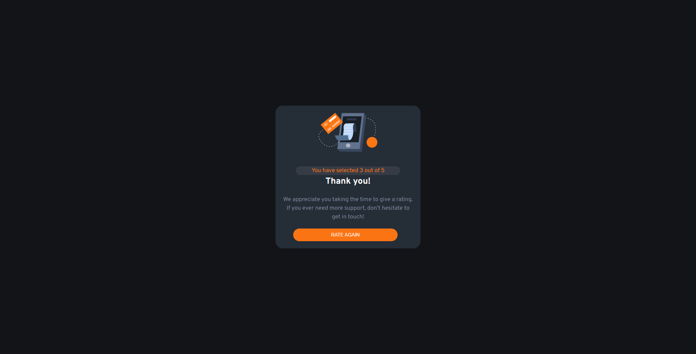

# Frontend Mentor - Interactive rating component solution

This is a solution to the [Interactive rating component challenge on Frontend Mentor](https://www.frontendmentor.io/challenges/interactive-rating-component-koxpeBUmI). Frontend Mentor challenges help you improve your coding skills by building realistic projects. 

## Table of contents

- [Overview](#overview)
  - [The challenge](#the-challenge)
  - [Screenshot](#screenshot)
  - [Links](#links)
- [My process](#my-process)
  - [Built with](#built-with)
  - [What I learned](#what-i-learned)
  - [Continued development](#continued-development)
  - [Useful resources](#useful-resources)
- [Author](#author)
- [Acknowledgments](#acknowledgments)

**Note: Delete this note and update the table of contents based on what sections you keep.**

## Overview

### The challenge

Users should be able to:

- View the optimal layout for the app depending on their device's screen size
- See hover states for all interactive elements on the page
- Select and submit a number rating
- See the "Thank you" card state after submitting a rating

### Screenshot

**Note: Delete this note and the paragraphs above when you add your screenshot. If you prefer not to add a screenshot, feel free to remove this entire section.**

### Links

- Solution URL: [Git Repo](https://github.com/Robert-Thaiyah/interactive-component)
- Live Site URL: [Livesite URL](https://robert-thaiyah.github.io/interactive-component/)

## My process

### Built with

- Semantic HTML5 markup
- CSS custom properties
- Flexbox
- CSS Grid
- Mobile-first workflow

**Note: These are just examples. Delete this note and replace the list above with your own choices**

### What I learned

**Note: Delete this note and the content within this section and replace with your own learnings.**

### Continued development

- JS Daily Practise

**Note: Delete this note and the content within this section and replace with your own plans for continued development.**

### Useful resources

- [Add Custom Radio Buttons CSS](https://www.youtube.com/watch?v=sSF0bXFUFGM&t=120s) - This helped me add custom css to radio buttons.
- [RAdio Buttons - MDN](https://developer.mozilla.org/en-US/docs/Web/HTML/Element/input/radio) - This is an amazing article which helped me finally understand radio buttons in JS.

**Note: Delete this note and replace the list above with resources that helped you during the challenge. These could come in handy for anyone viewing your solution or for yourself when you look back on this project in the future.**

## Author

- Website - [Robert Thaiyah](https://github.com/Robert-Thaiyah)
- Frontend Mentor - [@Robert-Thaiyah](https://www.frontendmentor.io/profile/Robert-Thaiyah)

**Note: Delete this note and add/remove/edit lines above based on what links you'd like to share.**

## Acknowledgments

This is where you can give a hat tip to anyone who helped you out on this project. Perhaps you worked in a team or got some inspiration from someone else's solution. This is the perfect place to give them some credit.

**Note: Delete this note and edit this section's content as necessary. If you completed this challenge by yourself, feel free to delete this section entirely.**
